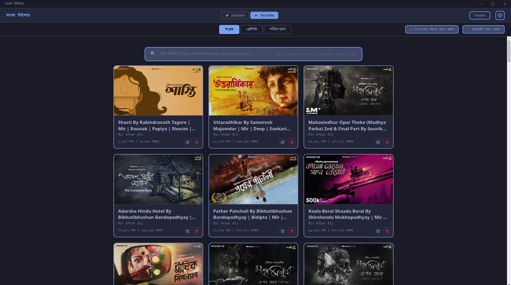
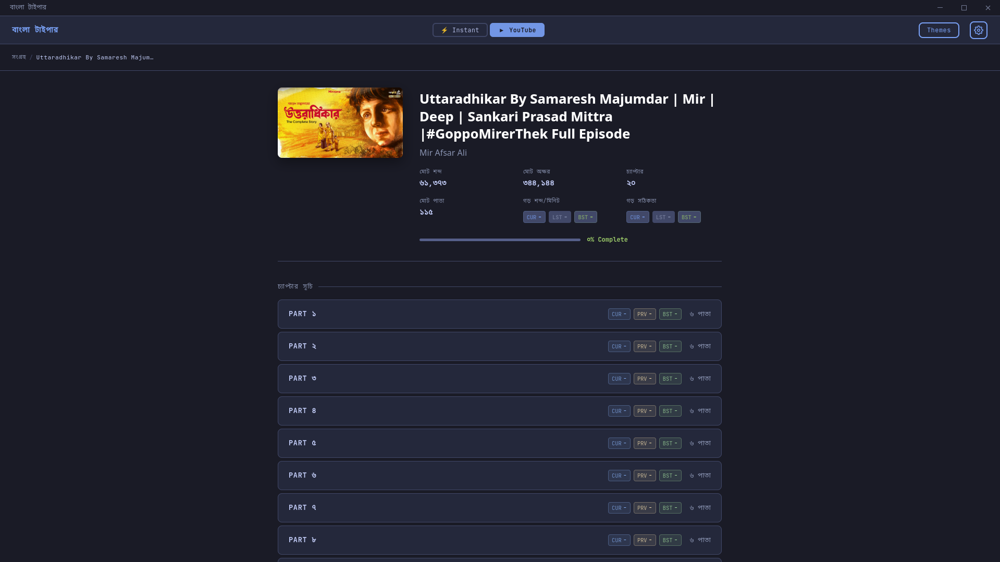
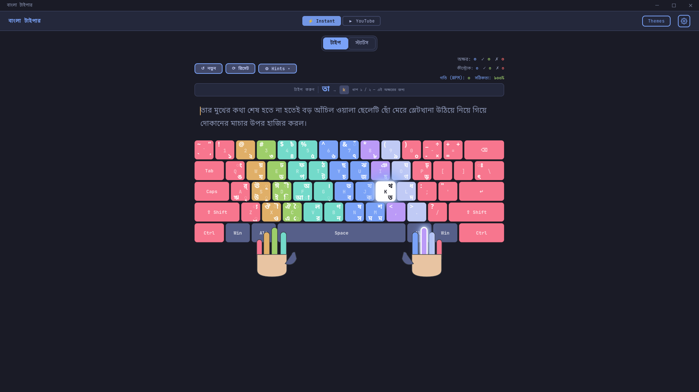
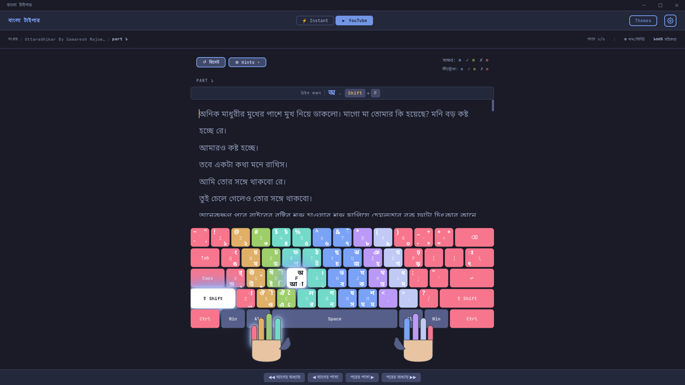

<h1 align="center">
  <br />
  Bangla Typer
</h1>

<p align="center">
  <strong>Master Bangla Typing with Real-World Content & YouTube Integration</strong><br />
  The ultimate modern typing trainer designed specifically for the unique challenges of the Bangla language.
</p>

<p align="center">
  <a href="LICENSE">
    
  </a>
  <a href="https://github.com/mehad605/Bangla_Typer/releases/latest">
    
  </a>
</p>

---

## 🎯 The Vision

Traditional typing tutors often treat Bangla like English, ignoring its phonetic complexity and unique character combinations. **Bangla Typer** bridges this gap by letting you practice using:
- 📖 **Real Literary Content**: Forget artificial word lists; practice with real Bangla literature.
- 🎥 **YouTube Subtitles**: Your favorite videos are now your practice sessions.
- 📊 **Insightful Metrics**: Track WPM, accuracy, and consistency with beautiful, real-time analytics.

---

## 📸 Screenshots

| Content Library | Playlist Chapters |
|:---:|:---:|
|  |  |

| Instant Mode Typing | YouTube Mode Typing |
|:---:|:---:|
|  |  |

---

## ✨ Features

### 📂 Content Mastery
- **YouTube Powered**: Automatically extract and clean subtitles from any YouTube URL and turn them into typing lessons.
- **Instant Mode**: Dive into curated high-quality Bangla passages immediately.
- **Smart Formatting**: No messy subtitles. Our engine cleans, breaks, and formats text into logical chapters.

### 📊 Performance Analytics
- **Live Metrics Dashboard**: Visual feedback on your current WPM, accuracy, and consistency.
- **Historical Tracking**: Interactive heatmaps and charts showing your growth over time.

### 🎨 Premium Experience
- **Sleek UI Themes**: High-contrast, easy-on-the-eyes themes including Tokyo Night, Dracula, Nord, and more.
- **Muscle Memory Aids**: Toggleable visual hints, including interactive keyboard layouts and finger positioning guides.
- **Offline First**: 100% privacy—all your data and settings stay where they belong: on your machine.

---

## 🚀 Quick Start

### 📦 Option 1: For Users
1. Download the latest release from the [Releases Page](https://github.com/mehad605/Bangla_Typer/releases/latest).
2. **Recommendation**: It is highly recommended to have **[yt-dlp](https://github.com/yt-dlp/yt-dlp)** installed on your system for the best experience with the YouTube integration feature.
3. **Debian/Ubuntu**: Install using the `.deb` package.
3. **Fedora/RHEL**: Install using the `.rpm` package.
4. **Universal Linux**: Run the `.AppImage` directly.
5. **Windows**: Run the provided installer `.exe`.

### 🛠️ Option 2: Run from Source
If you are a developer or want to experiment with the latest code:

```bash
# Clone the repository
git clone https://github.com/mehad605/Bangla_Typer.git
cd Bangla_Typer

# Install dependencies
uv sync
npm install

# Run desktop app (Tauri + FastAPI sidecar)
npm run dev

# Backend only (optional)
uv run uvicorn app.main:app --reload --host 127.0.0.1 --port 8000
```

---

## 🛠️ Development & Building

Bangla Typer uses an automated build system to create production-ready packages.

### Prerequisites
- **Python 3.13+** and **uv** (Recommended).
- **Linux Tools**: `dpkg` (for deb), `rpm` (for rpm).

### Building Locally
To package the application for your current OS:
```bash
# Prepare environment
uv sync --locked

# Run the build script
uv run build.py
```
**Artifacts** will be created in the `dist/` folder (or root for `.deb`).

### 🔄 Automated Release Workflow
Releases are handled via GitHub Actions. 

**To trigger a new production release:**
1. Update the version in `pyproject.toml`.
2. Push a new git tag matching the semantic versioning pattern:
   ```bash
   git tag v1.0.0
   git push origin v1.0.0
   ```
3. Alternatively, trigger it manually from the **Actions** tab on GitHub using "Run workflow".

---

## ⚙️ Configuration & Data

The application follows platform-standard conventions for storing settings and progress.
- **Settings (`config.json`)**:
  - **Windows**: `%LOCALAPPDATA%\bangla-typer\config.json`
  - **Linux**: `~/.config/bangla-typer/config.json`
  - **macOS**: `~/Library/Application Support/bangla-typer/config.json`
- **Data Directory**: By default, your lessons and database are stored in the same base directory as the config, but you can change this to any folder (e.g., a cloud-synced directory) via the in-app Settings.

---

## 🏗️ Technical Stack
- **Backend Core**: FastAPI for internal communication.
- **Desktop Shell**: Tauri v2 (Rust).
- **Frontend**: Vanilla JavaScript + HTML/CSS.
- **Automation**: GitHub Actions for CI/CD and multi-platform packaging.

---

## 💡 Troubleshooting
- **rpmbuild not found**: Non-critical. RPM creation will be skipped on systems without `rpm`.
- **appimagetool not found**: The build script attempts to auto-download this if missing.
- **Sidecar start issues**: Run `uv sync` and retry `npm run dev` so Python dependencies are available.

---

## 🤝 Contributing
1. **Fork** the repository.
2. **Create a Branch** for your feature or fix.
3. **Submit a PR**. Check [CHANGELOG.md](CHANGELOG.md) for recent project updates.

---

## 📄 License
Licensed under the **Creative Commons Attribution-NonCommercial-ShareAlike 4.0 International License**. See the [LICENSE](LICENSE) file for details.

---

<div align="center">
  <h3>🌟 Love Bangla Typer?</h3>
  <p>Give us a star! It is the best way to support the project and help others find it.</p>
</div>
